# AWS Summit Berlin 2019
italic texts are comments from my side

* about 6000 attendees per day
* _main topics: AI/ML, microservices, serverless and a bit of IoT_
* _several exhibitors offer a container / k8s environment on top of a multicloud framework_
* _as last years, there were also some backup and security providers of AWS, which you can spin up from the AWS Marketplace_
* _some talks are just repeated from re:Invent_

## 26.02.2019 Tuesday
* _more basic sessions_
* _some migration war stories_

### The Software Development Process at Amazon - How Services Are Created at AWS
_got carried away talked to an old colleague_
--> watch recording

### Keynote
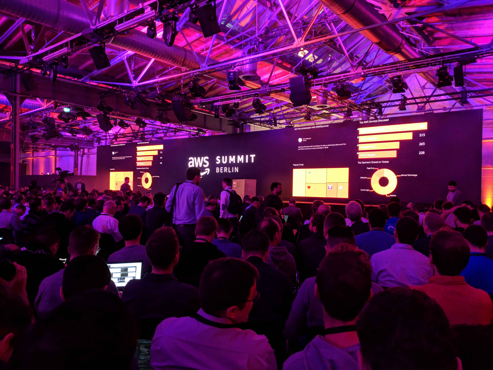
* 57,7% of Windows on Cloud is on AWS -- Azure = 30,9%
* AWS looking into hybrid solutions (on-prem + AWS) for a while now, e.g. databases
* TUI migrating to AWS until 2023
  * 600 applications, 550 databases
* Amazon: From monolith... via SOA... to microservices
  * 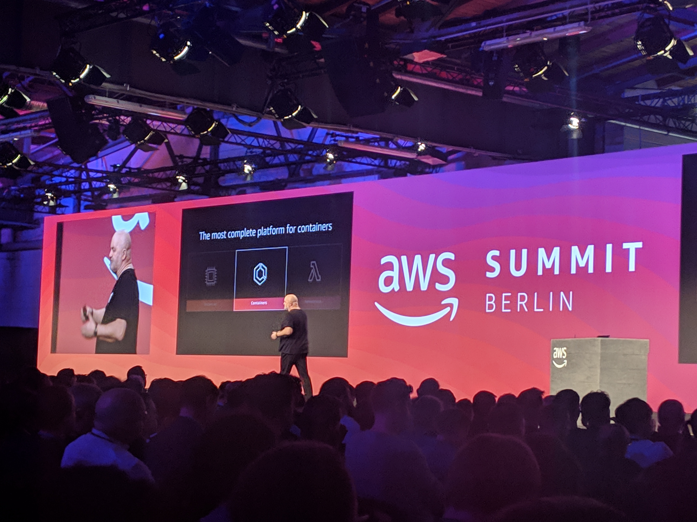
  * look at availability, security, reliability, and performance  requirements for each functional component on its own and handle it accordingly
  * compute instances are still fundamental building block
* Adidas has 16 k8s clusters globally with 6000+ pods
  * 50% faster pageload times after migrating to AWS
* Amazon Aurora keeps being the fastest growing database service on AWS
* Werner Vogels basically giving a summary of the Keynotes of re:Invent 2018
  * microservices, serverless, databases, managed blockchain, data lakes, etc.
* Siemens

### AWS Networking Fundamentals
_room overcrowded_
--> watch recording

### How to mass migrate to AWS while keeping operations up and running - Benefits and lessons learned
* guenstiger.de
* goal: decouple infrastructure
* old data center was EOL, showing some failures
* Why cloud?
  * flexibility, less maintenance (costs), no hardware failures, upgrade is easy (newer OS, more CPU, etc.)
  * scalability, smaller teams, fast infrastructure provisioning
* _speaker didn't seem to understand the concept of DevOps_
* How to migrate?
  * speed > cost
  * quality should at least be same
  * re-architect before the move
  * lift+shift
* Where should we start?
  1. Dont't start with EC2, start with networking and DNS!
     * e.g. VPN on-prem <-> cloud
  1. second: databases
  1. application last
* POCs upfront
  1. connectivity
     * e.g. DMS to keep databases in sync
     * time zones are important!
  1. Hadoop
     * hadoop vs. appserver workload matching
     * was still on CentOS6 with old Linux Kernel
        * go for m4 instance and evaluate solution later
* 2 weeks, 1 network engineer, 2 ~~Dev~Ops engineers~
* monitor your new infrastructure
  * to compare with on-prem
  * keep SLAs
* Benefits of the cloud
  * lower latency (now in Frankfurt instead of USA)
  * scalable and flexible
  * less maintenance effort (manpower and money)
  * more experimentation possible
    * fast spin up of prod like environment
* lessons learned - bad surprises
  * plan with cost buffer
    * AWS cost calculator missing out for e.g. data transfer costs
    * cross-AZ traffic costs are high
  * use proper tagging strategy for the resources
    * enables you to analyse costs easily
  * reality is changing
* lessons learned - good stuff
  * plan your migration thoroughly and just execute it
  * use AWS support (not only when in doubt)
  * migration was smooth (because of good plan and POCs)
  * note potential cost savers and take care later
* what's next?
  * cost optimization
  * good backup strategy instead of hotspare systems
  * use reserved instances
  * go cloud native --> use more managed services, use Lambda for microservices, etc.

### Get Started with Machine Learning and Computer Vision Using AWS DeepLens
* image recognition device
* train ML nodel, write inference code, setup AWS GreenGras
* Workflow
    * build a data set for training
    * Deploy model and Lambda function
    * run inference and local actions on device
    * send insights to the cloud
* AWS DeepLens device in cooperation with Intel
  * integrated with AWS SageMaker
  * SSH to device possible
  * TensorFlow, Caffe, Apache MXNet
  * Deploy trained model to device via GreenGras
* steps after deployment: 
  * load model, optimize model
  * get a video frame and predict
  * annotate live stream
#### DEMO
* good practice: split training data set and validation data set
* output: trained model
* device can talk to deployed EC2 instance or Lambda in the back

### Think You Are Ready for Microservices?
_room overcrowded_
--> watch recording

### Cloud Security: Myths & Opportunities
#### Myth #1: Attacks are getting more advanced
* there is advanced malware out there (e.g. Zeus, Conficker, Stuxnet, Flame, Duqu 2.0, Triton ...)
* Top 10 data breaches: 80% occurred in last two years / 40% occurred in 2018
* security organizations breached (e.g. Kaspersky)
* diversity of attacker's motivations
  * e.g. automating military and economic espionage
* attacker tactics for initial compromise
  * unpatched vulnerabilities
  * security misconfigurations
  * weak, leaked, stolen passwords
  * social engineering (e.g. trojan, phishing)
  * insider threat
* initial compromise first --> then advanced malware
* Least privilage
* Confidentiality, Integrity, Availability of Data (CIA)
#### Myth #2: On-premise IT is more secure than the cloud
* AWS region is cluster of multiple AZ'S
* AZ consists of multiple datacenters
* Advantages of the AWS API: 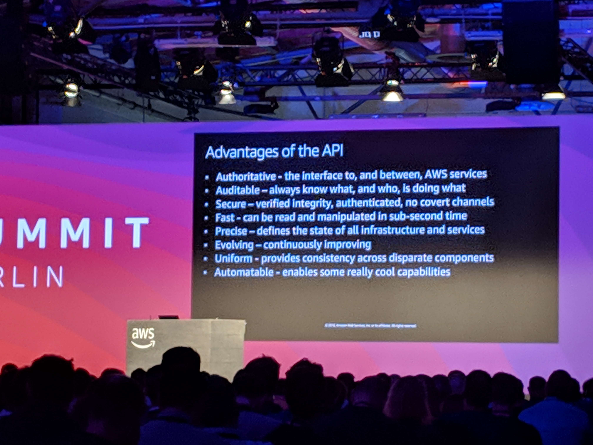
  * Authoritative
  * Auditable
  * Secure
  * Fast
  * Precise
  * Evolving
  * Uniform
  * Automatable
#### Myth #3: Data residency means better security
* physical location of datacenter doesn't mitigate any of the initial compromise tactics (see above, Myth #1)
* most threats are exploited remotely
* manual processes present risk of human error
  * Automation helps to prevent this
* lower risk of unauthorized access in the cloud
  * Encryption
  * Tokenization
  * Data Decomposition
  * Cyber Deception Defense
#### Opportunity: Higher levels of security assurance
* broad accreditations & certifications
* security assurance: 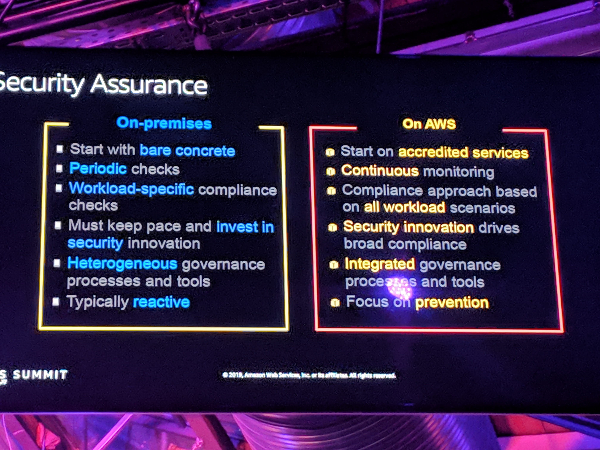
#### Opportunity: Innovation
* nearly 2000 new services, features, and capabilities in AWS in 2018 alone
* AWS does the heavy lifting

### Control for Your Cloud Environment Using AWS Management Tools
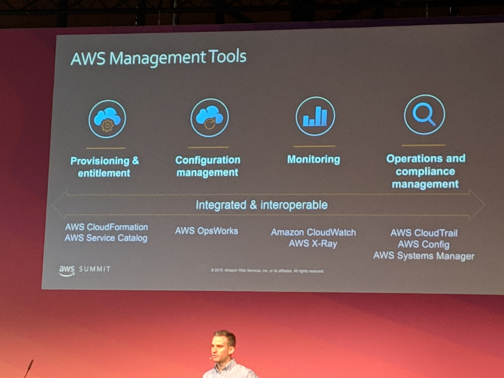
* AWS Cloudformation: automated creation and provisioning of AWS resources
* AWS Service Catalog: create and share immutable good practice templates
* AWS OpsWorks: managed configuration management server
  * supports chef automate, puppet enterprise
* AWS CloudWatch: monitoring of AWS cloud resources
  * can be filled with logs and metrics of applications too
  * can trigger alarms and notifications
* AWS X-ray: analyze and debug service requests
  * and-to-end tracing
* AWS Config: continuous recording and continuous assessment service
  * tracks config changes to AWS resources
  * alerts if config is not compliant with your policies
  * can provide guardrails for developers (e.g. S3 bucket public visibility)
    * can trigger actions if resource is not compliant
* AWS CloudTrail: record and centrally stored event logs of account activity
  * perform security audits and operational troubleshooting
  * can raise alarms for unwanted account activity
* AWS Systems Manager
  * automate execution of commands on machines / outside of machines
#### Enterprise as code
* complete automation and codification
* Infrastructure aC, Configuration aC, Operations aC, Compliance aC, application delivery as code
* AWS CodePipeline: 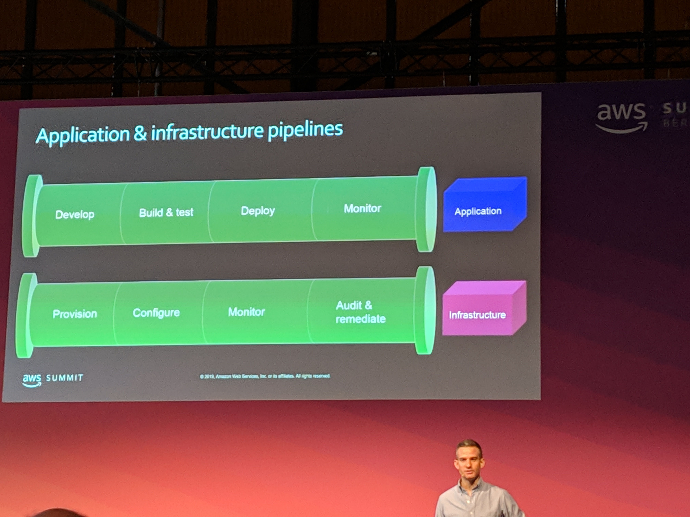
* AWS tools: 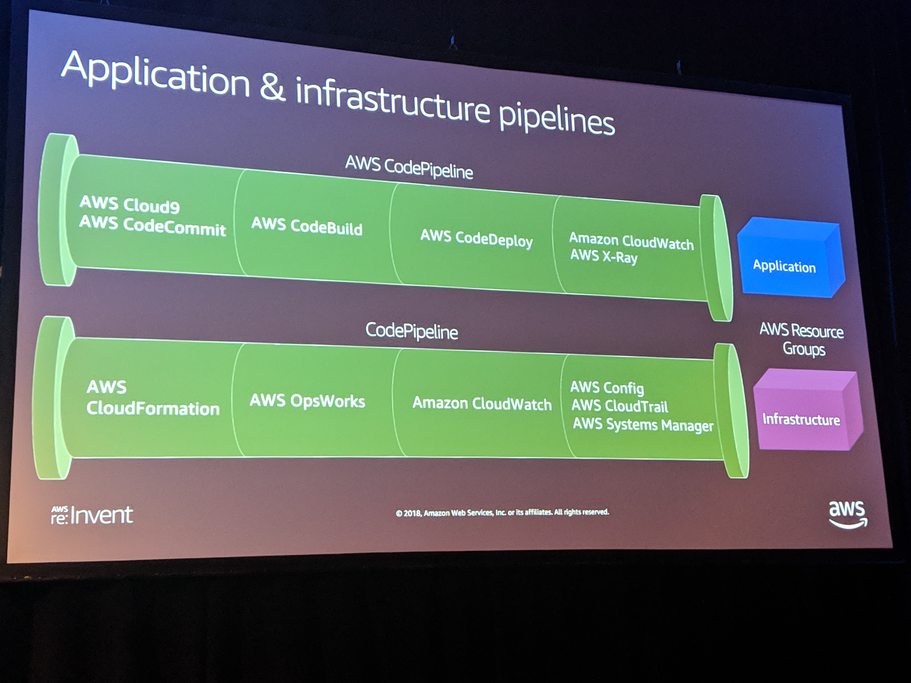
* AWS Resource Groups
  * matching resource group for the AWS CFn stack
  * use resource group to operate on in other services, e.g. CloudWatch, System Manager, etc.
* Create CloudWatch dashbaords for defined resource groups
* AWS Config Rule: e.g. no EC2 instance shall have port 80 (or 22) exposed to the internet

### Up and running with Amazon Linux WorkSpaces
* Amazon WorkSpaces: cloud desktops
* Amazon AppStream: application streaming
* Amazon WorkDocs: cloud storage
* Amazon Worklink: secure mobile access

* secure desktop environment in the cloud
* 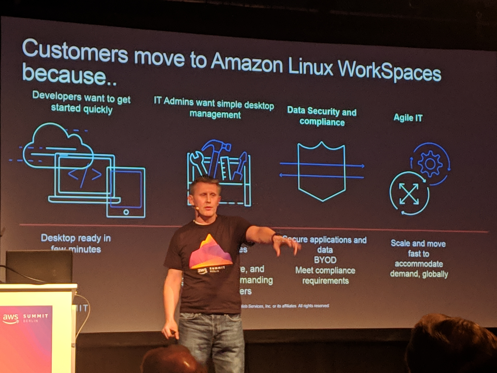
* Why use it?
  * quickly deployed
  * IT admins have soimple destop management
  * data security and compliance
  * agile
* build for the cloud, enterprise ready, innovation included
  * integrate with AD
  * AmazonLinux2 - LTS 5 years
  * optimized for AWS workloads
  * supports docker
* e.g. Java development environment
* good practice:
  * separate VPC for WorkSpaces
  * separate workloads -> different AD Connector and subnets / security groups (e.g. external contractors)
* Network Interfaces
  * management interface
  * Your VPC interface
* Data Partiotions
  * OS
  * user data
  * you can rebuild the workspaces' OS without loosing the user data
* different hardware options for different use cases (developers vs. frontoffice desk)
#### Walkthrough demo (recorded video)
* after creating a WorkSpace, you can configure it (install IDE etc.)
* do not install things in `/home`, as this would not be captured in the WorkSpace template
* create desktop icon via `/usr/share/applications/eclipse.desktop` / `/etc/rc.local`
* close template
* create WorkSpace image bundle
* you can update the bundle without affecting the user's data
* settings like e.g. desktop background can be locked --> corporate branding config
* use AWS OpsWorks to maintain the WorkSpace

## 27.02.2019 Wednesday
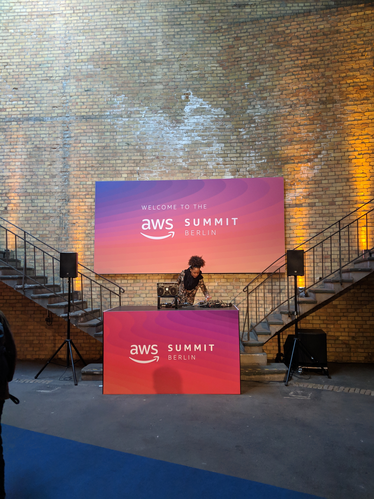
* _mostly advanced sessions_

### Full Stack in the Era of Serverless Computing
* HTML+CSS+jQuery not sufficient anymore
* SPAs, Complex data frameworks, etc.
* Mobile Development: real-time, offline, etc.
* rise of cross-platform application frameworks
* move from on-prem to cloud
* cloud: offsite, distributed datacenters
* serverless: compute time instead of compute resources
* no FE, BE, Ops engineers anymore, just engineers/developers
* "service-full": more serverless -> more external dependencies (E.g. Kafka, Kinesis)
  * loosely coupled, fault-isolated
* AWS Amplify
  * CLI, console
  * common base framework for web and mobile apps
  * Vue, Angular, React supported
  * running on serverless infrastructure
  * integrates with Cognito (Auth), AppSync, DynamoDB, Pinpoint (metrics)

### Keynote
* do not split your monolith by data, but by function
  * "User component" -> auth and address book handled by the same software component unnecessarily
  * auth called on every page, address book only in checkout
  * but scaling together (by force)
* API is the front door of your service
* public APIs a hard to change as soon as they are published
  * AWS API Gateway
* Three basic patterns of microservices: API, Event, continuous data stream
* AWS Lambda vs. AWS Step Functions
* "cloud native architecture are small pieces, loosely joined" - Werner Vogels
* Developer, Operations, Security and Compliance all part of new Developer role definition
* 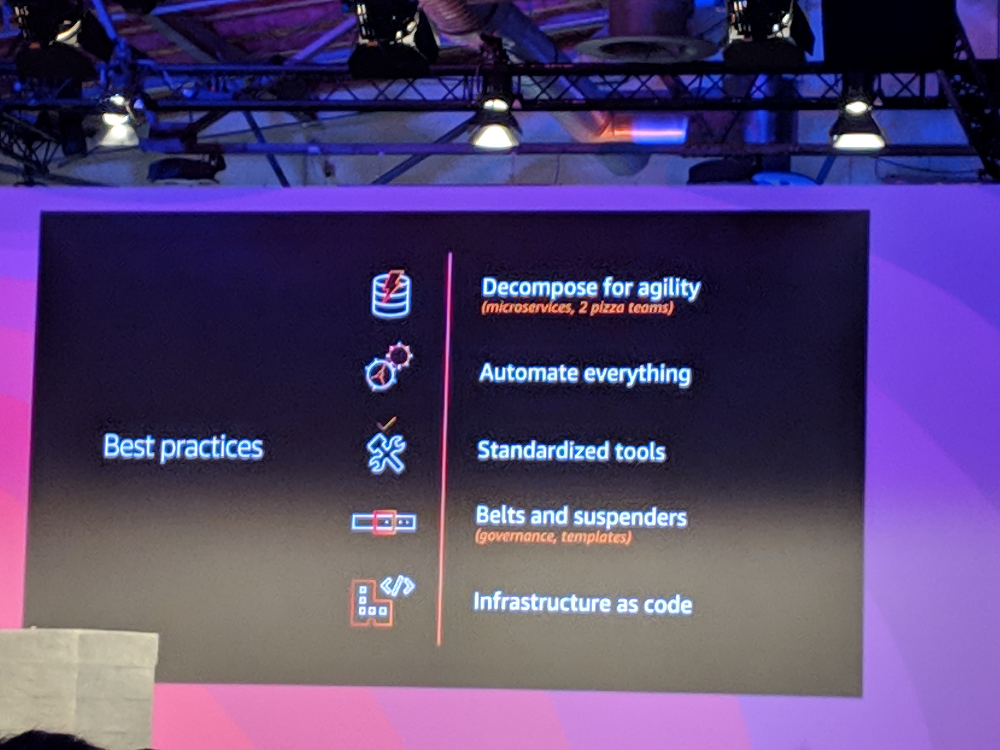

### Containers in the Cloud: The Good, the Bad, and the Ugly
#### The good - theory
* simplifying Development & deployment
  * bundles app and its dependencies
  * no more "works on my machine"
  * common deployment pipeline mechanism
* Security & Operations
  * stronger isolation -> less attack surface
* Cost efficiencies
  * less infrastructure to run same workload
* Culture
  * cross-functional "DevOps" teams
  * room for innovation
  * increased ownership
  * 12 factor app methodology
  * you build it you run it
* Doing container is more than just using docker: 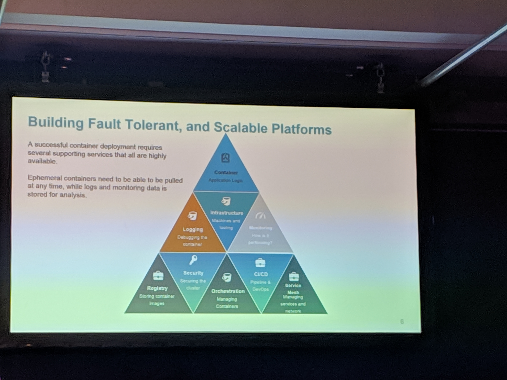
  * don't get the newest shit, when migrating to containers
  * use well established, stable services

#### case study - lessons learned
* the good
    * abstracted from underlying technology or geography
    * everything can be versioned
    * native support for CI/CD pipelines with testing
    * change of culture and way of deployment
* The bad
    * complex env to operate
    * hjigh run cost
    * fragile architecture
    * don't containerize commercial off-the-shelf (COTS) software - licence issue?
* The ugly
    * relies on many unsupported and obscure software libs
    * lots of hacks and tweaks to glue it together
    * dev time of 9 months for one container platform

### Microservices on AWS: Architectural Patterns and Best Practices
_room overcrowded_
--> watch recording

### Organic Architecture: Keep Your Business Agile While Deploying Hundreds of Microservices on AWS
* Decompose for agility
* Automate everything
* Standardized tools,
* Belts and suspenders
* Infrastructure as code

### Serverless Open Location Data with HERE XYZ
* HERE maps is heavily used in cars
* also have a web version
* HERE.XYZ = cloud-based location management
  * based on open standards like GeoJSON
* XYZ Studio: we-based editor
* AWS API Gateway
  * handles auth
  * multiple backend integrations
* ECS
  * optimize hardware utilization
  * standardized way to deploy
* self-managed ECS-Cluster (no Fargate)
  * time and effort overhead
  * upgrade docker daemon version
  * container logging
  * cluster scaling
  * issues with isolation of disk and processing resources
* moved to ECS with Fargate afterwards
  * managed container cluster
* using chain of Lambda tasks for processing map data
* challenges with Lambda
  1. slow execution time on first invocation --> keep lambda warm with artificial traffic
  1. choosing the right memory settings: memory impacts performance --> experiment
  1. data transfer limit: max payload size is 6MB --> compression, external storage
  1. scale with care: concurrency limit (global and local)
     * use VPC only if your Lambda needs internal access
* 3 levels of caching: redis, CloudFront Edge locations (API Gateway), browser
* challenge of isolated components: use contract based development and well defined interfaces
* Debugging and Testing
  * run SAM locally
  * mocking
  * debugging locally in the IDE
* Logging
  * use global tracking ID across all components
  * central logging platform
#### The good
* cost and effort efficiency
  * scaling and parallelization
  * pay as you go
  * reusability

### How Websites Go Serverless
* serverless is for relieving the developers of having to take care about infrastructure
  * automatic scaling
  * no infrastructure provisioning
  * pay for value
  * highly available and secure
* Three-tier web application architecture: presentation, logic, data
  * mostly forgotten: the sorrounding things, e.g. DNS
* Serverless web application:
  * User --> CloudFront --> S3 Bucket   (static website)
  * User --> API Gateway --> Lambda --> DynamoDB   (dynamic content)
  * think about Cognito for user management, auth, mailing etc.
* multi-region with API Gateway
  * Route53 routing based on user location
* WebSockets supported by API Gateway since November
* somebody's demo webshop: https://bit.ly/ServerlessShop
* splitting Lambdas for data read vs. data write for security concerns (least privilege)
* AWS Amplify Framework: Open Source Developer Toolchain for serverless
  * Auth, Storage, Analytics, Interactions, API
* AWS Amplify Console
  * continuous deployment and hosting service for mobile web applications
  * AWS Console (web view)

### ECS Deep Dive
* AWS native container stack:
    * image registry: ECR
    * container management: ECS
    * container hosting: Fargate
* ECR+ECS+Fargate
  * ECS bin packs container on the provided hosts
  * Fargate manages the underlying hosts for running the containers on
* ECS Task definition can consist of multiple containers
  * you can define CPU+Mem on Task level and / or on container level
  * CPU+Mem not defined: limitation is the hosts CPU+Mem
  * separate definition for critical state possible
* with Fargate you only pay for the resources the running containers consume, not the whole underlying EC2 instance
* every Fargate Task gets its own network interface (ENI)
* Task can define an ALB
* let the Container log to stdout --> CloudWatch Logs
* Free tier:
  * 500 MB storage
  * 750 hours of compute
  * 750 hours elastic load balancing

